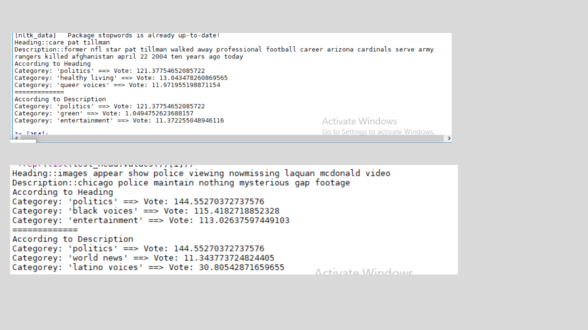

here file.txt is the input file.I have converted json to txt as json format was wrong
Devide data into 2 parts (train and test ) in 70:30 ratio
* I have commented the code
As data is too much biased maximum time it is unable to predict the right one in first priority based.
I have tried to categorized it through probability.I have printed top 3 predicted categories for the sentence
here are some sample output

